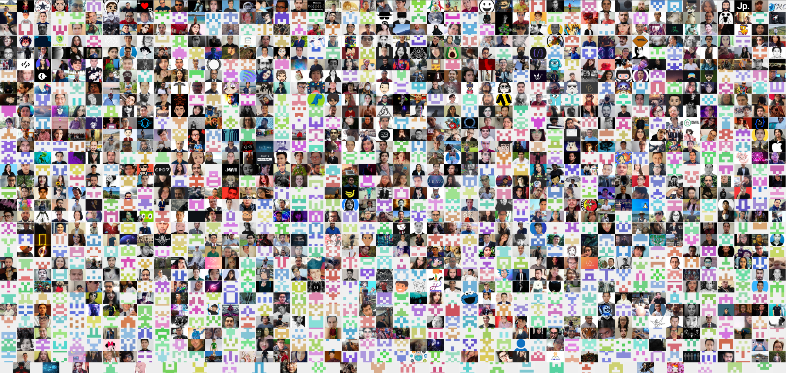

<h1>Hello 😁, I'm Rafael Vilches :octocat:</h1>

💻 Software Developer&nbsp;&nbsp;|&nbsp;&nbsp; 🔭 Systems Analyst&nbsp;&nbsp;|&nbsp;&nbsp;🚢 Project Manager 

    <a href="https://platzi.com/r/leafar/" target="_blank">
        
        <b>🟡Win a free month at Platzi 🎁</b>
    </a>

 

|  |  |
| ------------- | ------------- |

<a href="https://yearbook-nodejs.herokuapp.com/" title="Yearbook LaunchX May 2022 Woopa!"> <h1>Yearbook LaunchX May 2022</h1> </a>

