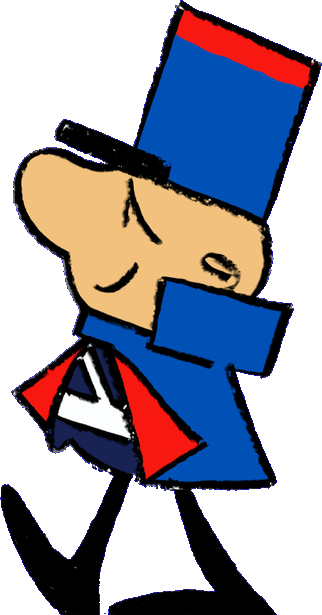

<h3>Hello 😁, I'm <i>Rafael</i>&nbsp;&nbsp;:octocat:&nbsp;&nbsp;Software Developer 💻&nbsp;&nbsp;|&nbsp;&nbsp; Systems Analyst 🔭&nbsp;&nbsp;|&nbsp;&nbsp;Project Manager 🚢</h3>

    

        
<b>🎁 Open me if you want a prize (Sponsors)</b>

        <a href="https://unicef.org.mx/donaciones/" target="_blank">
            
            <b> Donate to Unicef 💸</b>
        </a>
         
        <a href="https://www.who.int/emergencies/diseases/novel-coronavirus-2019/donate" target="_blank">
            
            <b> Donate to World Health Organization to fight COVID-19 💸</b>
        </a>
         
        <a href="https://platzi.com/r/leafar/" target="_blank">
            
            <b>🟡 Win a free month at Platzi 🎁</b>
        </a>
         
        <a href="https://py.pl/DA7CF" target="_blank">
            
            <b>🟢 Win a PayPal Coupon 🎁</b>
        </a>
         
        <a href="https://mpago.li/1qnAQDo" target="_blank">
            
            <b>🟠 Win a ML MP Discount 🎁</b>
        </a>
         
        <a href="https://mpago.li/17t2HPt" target="_blank">
            
            <b>🔵 Win a ML Coupon 🎁</b>
        </a>
         
        <a href="https://www.buymeacoffee.com/doguedogue" target="_blank">
            
            <b>🟣 Buy me a coffee ☕</b>
        </a>        
         
        <a href="https://paypal.me/doguedogue" target="_blank">
            
            <b>➡️➡️➡️➡️ Or Just PayPal.Me 😹😹😹💸</b>
        </a>
    

 

 

### Certifications 🚀

<a href="https://www.scrumstudy.com/certification/verify?type=SMC&number=792988" target="_blank"> 
<a href="https://www.scrumstudy.com/certification/verify?type=SFC&number=602688" target="_blank"> 
<a href="https://www.credly.com/badges/befcc041-e63d-4a70-8f4c-ea02bee9b25e" target="_blank"> 
<a href="https://catalog-education.oracle.com/pls/certview/sharebadge?id=D22C510C1A006194B0723C4C967D402271D3590B733F266B420CF711ED7E98A5&fbclid=IwAR3DzL7Oh5-CTKcM1Oe5z3Km2AtGja-P2ZitC52vkh5jMAA24X0svhSP2I4" target="_blank">
<a href="https://app.aluracursos.com/program/certificate/d53f380a-72e4-4503-8ea4-9c0095f10246" target="_blank">
<a href="https://www.credly.com/badges/e1846235-7ca5-4497-a420-b0fc61d416ec" target="_blank">    

    
### Communities 🛸

 

 

